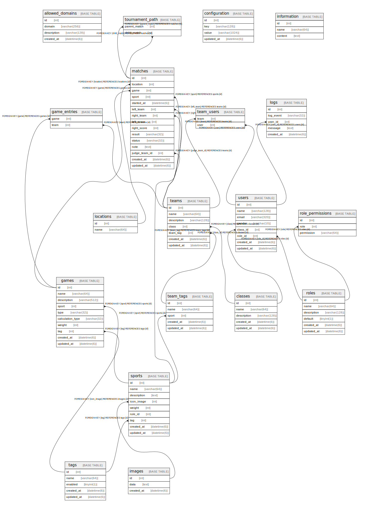

# db

## Tables

| Name | Columns | Comment | Type |
| ---- | ------- | ------- | ---- |
| [allowed_domains](allowed_domains.md) | 4 |  | BASE TABLE |
| [classes](classes.md) | 6 |  | BASE TABLE |
| [configuration](configuration.md) | 4 |  | BASE TABLE |
| [game_entries](game_entries.md) | 2 |  | BASE TABLE |
| [games](games.md) | 10 |  | BASE TABLE |
| [groups](groups.md) | 5 |  | BASE TABLE |
| [images](images.md) | 3 |  | BASE TABLE |
| [information](information.md) | 3 |  | BASE TABLE |
| [locations](locations.md) | 2 |  | BASE TABLE |
| [logs](logs.md) | 5 |  | BASE TABLE |
| [matches](matches.md) | 15 |  | BASE TABLE |
| [sports](sports.md) | 9 |  | BASE TABLE |
| [tags](tags.md) | 5 |  | BASE TABLE |
| [team_tags](team_tags.md) | 4 |  | BASE TABLE |
| [team_users](team_users.md) | 2 |  | BASE TABLE |
| [teams](teams.md) | 7 |  | BASE TABLE |
| [tournament_path](tournament_path.md) | 2 |  | BASE TABLE |
| [users](users.md) | 8 |  | BASE TABLE |

## Relations

---

> Generated by [tbls](https://github.com/k1LoW/tbls)
