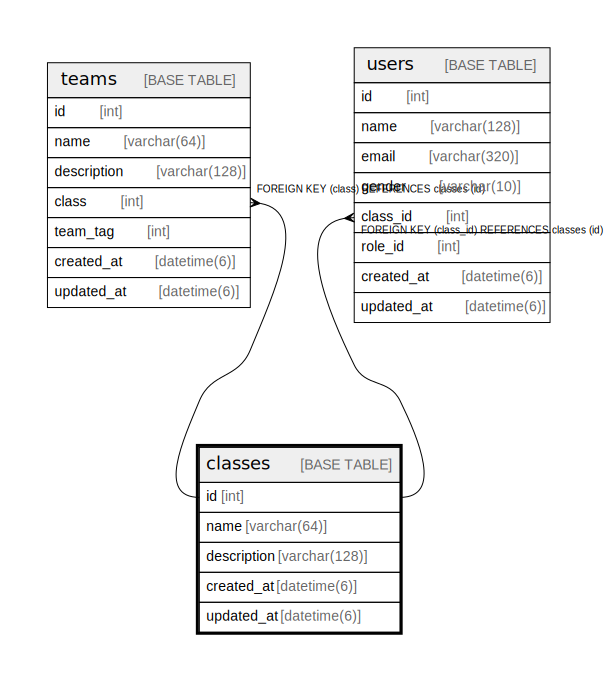

# classes

## Description

<details>
<summary><strong>Table Definition</strong></summary>

```sql
CREATE TABLE `classes` (
  `id` int NOT NULL AUTO_INCREMENT,
  `name` varchar(64) NOT NULL,
  `description` varchar(128) DEFAULT NULL,
  `group` int NOT NULL,
  `created_at` datetime(6) NOT NULL,
  `updated_at` datetime(6) NOT NULL,
  PRIMARY KEY (`id`),
  KEY `fk_classes_group__id` (`group`),
  CONSTRAINT `fk_classes_group__id` FOREIGN KEY (`group`) REFERENCES `groups` (`id`) ON DELETE CASCADE ON UPDATE RESTRICT
) ENGINE=InnoDB AUTO_INCREMENT=[Redacted by tbls] DEFAULT CHARSET=utf8mb4 COLLATE=utf8mb4_0900_ai_ci
```

</details>

## Columns

| Name | Type | Default | Nullable | Extra Definition | Children | Parents | Comment |
| ---- | ---- | ------- | -------- | ---------------- | -------- | ------- | ------- |
| id | int |  | false | auto_increment | [teams](teams.md) [users](users.md) |  |  |
| name | varchar(64) |  | false |  |  |  |  |
| description | varchar(128) |  | true |  |  |  |  |
| group | int |  | false |  |  | [groups](groups.md) |  |
| created_at | datetime(6) |  | false |  |  |  |  |
| updated_at | datetime(6) |  | false |  |  |  |  |

## Constraints

| Name | Type | Definition |
| ---- | ---- | ---------- |
| fk_classes_group__id | FOREIGN KEY | FOREIGN KEY (group) REFERENCES groups (id) |
| PRIMARY | PRIMARY KEY | PRIMARY KEY (id) |

## Indexes

| Name | Definition |
| ---- | ---------- |
| fk_classes_group__id | KEY fk_classes_group__id (group) USING BTREE |
| PRIMARY | PRIMARY KEY (id) USING BTREE |

## Relations



---

> Generated by [tbls](https://github.com/k1LoW/tbls)
