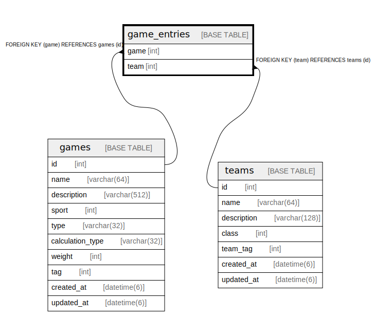

# game_entries

## Description

<details>
<summary><strong>Table Definition</strong></summary>

```sql
CREATE TABLE `game_entries` (
  `game` int NOT NULL,
  `team` int NOT NULL,
  PRIMARY KEY (`game`,`team`),
  KEY `fk_game_entries_team__id` (`team`),
  CONSTRAINT `fk_game_entries_game__id` FOREIGN KEY (`game`) REFERENCES `games` (`id`) ON DELETE CASCADE ON UPDATE RESTRICT,
  CONSTRAINT `fk_game_entries_team__id` FOREIGN KEY (`team`) REFERENCES `teams` (`id`) ON DELETE CASCADE ON UPDATE RESTRICT
) ENGINE=InnoDB DEFAULT CHARSET=utf8mb4 COLLATE=utf8mb4_0900_ai_ci
```

</details>

## Columns

| Name | Type | Default | Nullable | Children | Parents | Comment |
| ---- | ---- | ------- | -------- | -------- | ------- | ------- |
| game | int |  | false |  | [games](games.md) |  |
| team | int |  | false |  | [teams](teams.md) |  |

## Constraints

| Name | Type | Definition |
| ---- | ---- | ---------- |
| fk_game_entries_game__id | FOREIGN KEY | FOREIGN KEY (game) REFERENCES games (id) |
| fk_game_entries_team__id | FOREIGN KEY | FOREIGN KEY (team) REFERENCES teams (id) |
| PRIMARY | PRIMARY KEY | PRIMARY KEY (game, team) |

## Indexes

| Name | Definition |
| ---- | ---------- |
| fk_game_entries_team__id | KEY fk_game_entries_team__id (team) USING BTREE |
| PRIMARY | PRIMARY KEY (game, team) USING BTREE |

## Relations



---

> Generated by [tbls](https://github.com/k1LoW/tbls)
