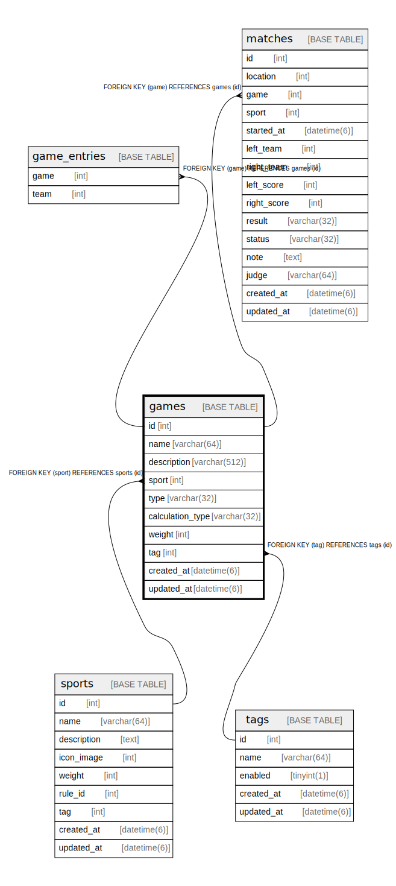

# games

## Description

<details>
<summary><strong>Table Definition</strong></summary>

```sql
CREATE TABLE `games` (
  `id` int NOT NULL AUTO_INCREMENT,
  `name` varchar(64) NOT NULL,
  `description` varchar(512) NOT NULL,
  `sport` int NOT NULL,
  `type` varchar(32) NOT NULL,
  `calculation_type` varchar(32) NOT NULL DEFAULT 'DIFF_SCORE',
  `weight` int NOT NULL,
  `tag` int DEFAULT NULL,
  `created_at` datetime(6) NOT NULL,
  `updated_at` datetime(6) NOT NULL,
  PRIMARY KEY (`id`),
  KEY `fk_games_sport__id` (`sport`),
  KEY `fk_games_tag__id` (`tag`),
  CONSTRAINT `fk_games_sport__id` FOREIGN KEY (`sport`) REFERENCES `sports` (`id`) ON DELETE CASCADE ON UPDATE RESTRICT,
  CONSTRAINT `fk_games_tag__id` FOREIGN KEY (`tag`) REFERENCES `tags` (`id`) ON DELETE SET NULL ON UPDATE RESTRICT
) ENGINE=InnoDB DEFAULT CHARSET=utf8mb4 COLLATE=utf8mb4_0900_ai_ci
```

</details>

## Columns

| Name | Type | Default | Nullable | Extra Definition | Children | Parents | Comment |
| ---- | ---- | ------- | -------- | ---------------- | -------- | ------- | ------- |
| id | int |  | false | auto_increment | [game_entries](game_entries.md) [matches](matches.md) |  |  |
| name | varchar(64) |  | false |  |  |  |  |
| description | varchar(512) |  | false |  |  |  |  |
| sport | int |  | false |  |  | [sports](sports.md) |  |
| type | varchar(32) |  | false |  |  |  |  |
| calculation_type | varchar(32) | DIFF_SCORE | false |  |  |  |  |
| weight | int |  | false |  |  |  |  |
| tag | int |  | true |  |  | [tags](tags.md) |  |
| created_at | datetime(6) |  | false |  |  |  |  |
| updated_at | datetime(6) |  | false |  |  |  |  |

## Constraints

| Name | Type | Definition |
| ---- | ---- | ---------- |
| fk_games_sport__id | FOREIGN KEY | FOREIGN KEY (sport) REFERENCES sports (id) |
| fk_games_tag__id | FOREIGN KEY | FOREIGN KEY (tag) REFERENCES tags (id) |
| PRIMARY | PRIMARY KEY | PRIMARY KEY (id) |

## Indexes

| Name | Definition |
| ---- | ---------- |
| fk_games_sport__id | KEY fk_games_sport__id (sport) USING BTREE |
| fk_games_tag__id | KEY fk_games_tag__id (tag) USING BTREE |
| PRIMARY | PRIMARY KEY (id) USING BTREE |

## Relations



---

> Generated by [tbls](https://github.com/k1LoW/tbls)
