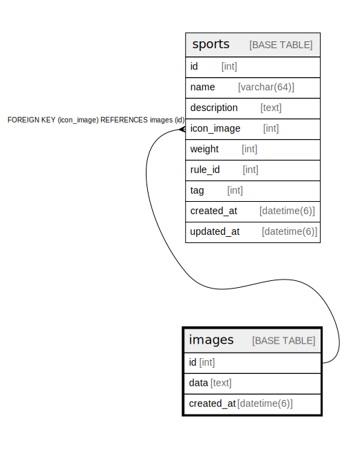

# images

## Description

<details>
<summary><strong>Table Definition</strong></summary>

```sql
CREATE TABLE `images` (
  `id` int NOT NULL AUTO_INCREMENT,
  `name` varchar(64) NOT NULL,
  `attachment` text NOT NULL,
  `created_at` datetime(6) NOT NULL,
  `created_by` int DEFAULT NULL,
  PRIMARY KEY (`id`),
  KEY `fk_images_created_by__id` (`created_by`),
  CONSTRAINT `fk_images_created_by__id` FOREIGN KEY (`created_by`) REFERENCES `microsoft_accounts` (`id`) ON DELETE SET NULL ON UPDATE RESTRICT
) ENGINE=InnoDB DEFAULT CHARSET=utf8mb4 COLLATE=utf8mb4_0900_ai_ci
```

</details>

## Columns

| Name | Type | Default | Nullable | Extra Definition | Children | Parents | Comment |
| ---- | ---- | ------- | -------- | ---------------- | -------- | ------- | ------- |
| id | int |  | false | auto_increment | [sports](sports.md) |  |  |
| name | varchar(64) |  | false |  |  |  |  |
| attachment | text |  | false |  |  |  |  |
| created_at | datetime(6) |  | false |  |  |  |  |
| created_by | int |  | true |  |  | [microsoft_accounts](microsoft_accounts.md) |  |

## Constraints

| Name | Type | Definition |
| ---- | ---- | ---------- |
| fk_images_created_by__id | FOREIGN KEY | FOREIGN KEY (created_by) REFERENCES microsoft_accounts (id) |
| PRIMARY | PRIMARY KEY | PRIMARY KEY (id) |

## Indexes

| Name | Definition |
| ---- | ---------- |
| fk_images_created_by__id | KEY fk_images_created_by__id (created_by) USING BTREE |
| PRIMARY | PRIMARY KEY (id) USING BTREE |

## Relations



---

> Generated by [tbls](https://github.com/k1LoW/tbls)
