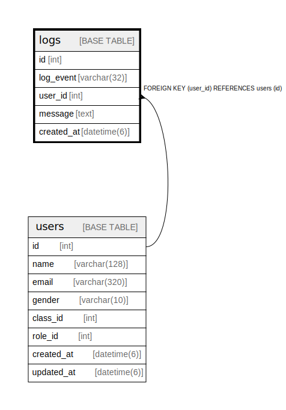

# logs

## Description

<details>
<summary><strong>Table Definition</strong></summary>

```sql
CREATE TABLE `logs` (
  `id` int NOT NULL AUTO_INCREMENT,
  `log_event` varchar(32) NOT NULL,
  `user_id` int DEFAULT NULL,
  `message` text NOT NULL,
  `created_at` datetime(6) NOT NULL,
  PRIMARY KEY (`id`),
  KEY `fk_logs_user_id__id` (`user_id`),
  CONSTRAINT `fk_logs_user_id__id` FOREIGN KEY (`user_id`) REFERENCES `users` (`id`) ON DELETE SET NULL ON UPDATE RESTRICT
) ENGINE=InnoDB DEFAULT CHARSET=utf8mb4 COLLATE=utf8mb4_0900_ai_ci
```

</details>

## Columns

| Name | Type | Default | Nullable | Extra Definition | Children | Parents | Comment |
| ---- | ---- | ------- | -------- | ---------------- | -------- | ------- | ------- |
| id | int |  | false | auto_increment |  |  |  |
| log_event | varchar(32) |  | false |  |  |  |  |
| user_id | int |  | true |  |  | [users](users.md) |  |
| message | text |  | false |  |  |  |  |
| created_at | datetime(6) |  | false |  |  |  |  |

## Constraints

| Name | Type | Definition |
| ---- | ---- | ---------- |
| fk_logs_user_id__id | FOREIGN KEY | FOREIGN KEY (user_id) REFERENCES users (id) |
| PRIMARY | PRIMARY KEY | PRIMARY KEY (id) |

## Indexes

| Name | Definition |
| ---- | ---------- |
| fk_logs_user_id__id | KEY fk_logs_user_id__id (user_id) USING BTREE |
| PRIMARY | PRIMARY KEY (id) USING BTREE |

## Relations



---

> Generated by [tbls](https://github.com/k1LoW/tbls)
