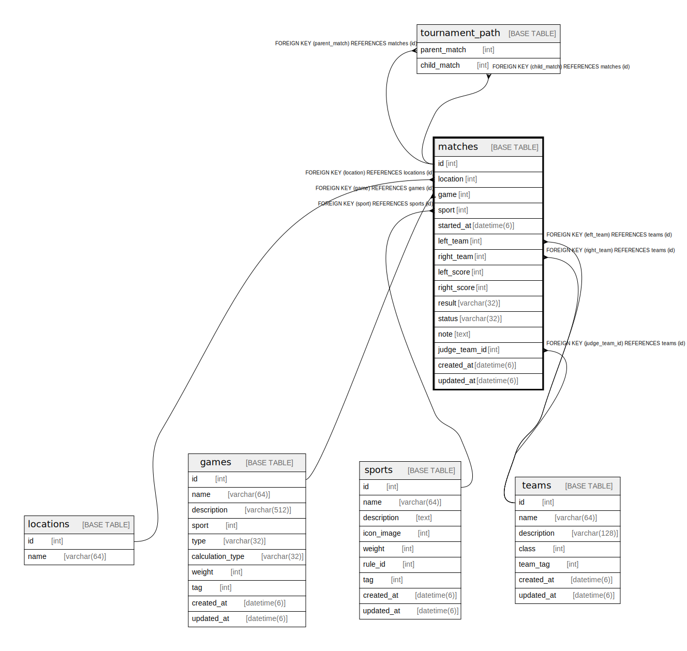

# matches

## Description

<details>
<summary><strong>Table Definition</strong></summary>

```sql
CREATE TABLE `matches` (
  `id` int NOT NULL AUTO_INCREMENT,
  `location` int DEFAULT NULL,
  `game` int NOT NULL,
  `sport` int NOT NULL,
  `started_at` datetime(6) NOT NULL,
  `left_team` int DEFAULT NULL,
  `right_team` int DEFAULT NULL,
  `left_score` int NOT NULL DEFAULT '0',
  `right_score` int NOT NULL DEFAULT '0',
  `result` varchar(32) NOT NULL DEFAULT 'DRAW',
  `status` varchar(32) NOT NULL,
  `note` text,
  `judge` varchar(64) DEFAULT NULL,
  `created_at` datetime(6) NOT NULL,
  `updated_at` datetime(6) NOT NULL,
  PRIMARY KEY (`id`),
  KEY `fk_matches_location__id` (`location`),
  KEY `fk_matches_game__id` (`game`),
  KEY `fk_matches_sport__id` (`sport`),
  KEY `fk_matches_left_team__id` (`left_team`),
  KEY `fk_matches_right_team__id` (`right_team`),
  CONSTRAINT `fk_matches_game__id` FOREIGN KEY (`game`) REFERENCES `games` (`id`) ON DELETE CASCADE ON UPDATE RESTRICT,
  CONSTRAINT `fk_matches_left_team__id` FOREIGN KEY (`left_team`) REFERENCES `teams` (`id`) ON DELETE SET NULL ON UPDATE RESTRICT,
  CONSTRAINT `fk_matches_location__id` FOREIGN KEY (`location`) REFERENCES `locations` (`id`) ON DELETE SET NULL ON UPDATE RESTRICT,
  CONSTRAINT `fk_matches_right_team__id` FOREIGN KEY (`right_team`) REFERENCES `teams` (`id`) ON DELETE SET NULL ON UPDATE RESTRICT,
  CONSTRAINT `fk_matches_sport__id` FOREIGN KEY (`sport`) REFERENCES `sports` (`id`) ON DELETE CASCADE ON UPDATE RESTRICT
) ENGINE=InnoDB DEFAULT CHARSET=utf8mb4 COLLATE=utf8mb4_0900_ai_ci
```

</details>

## Columns

| Name | Type | Default | Nullable | Extra Definition | Children | Parents | Comment |
| ---- | ---- | ------- | -------- | ---------------- | -------- | ------- | ------- |
| id | int |  | false | auto_increment | [tournament_path](tournament_path.md) |  |  |
| location | int |  | true |  |  | [locations](locations.md) |  |
| game | int |  | false |  |  | [games](games.md) |  |
| sport | int |  | false |  |  | [sports](sports.md) |  |
| started_at | datetime(6) |  | false |  |  |  |  |
| left_team | int |  | true |  |  | [teams](teams.md) |  |
| right_team | int |  | true |  |  | [teams](teams.md) |  |
| left_score | int | 0 | false |  |  |  |  |
| right_score | int | 0 | false |  |  |  |  |
| result | varchar(32) | DRAW | false |  |  |  |  |
| status | varchar(32) |  | false |  |  |  |  |
| note | text |  | true |  |  |  |  |
| judge | varchar(64) |  | true |  |  |  |  |
| created_at | datetime(6) |  | false |  |  |  |  |
| updated_at | datetime(6) |  | false |  |  |  |  |

## Constraints

| Name | Type | Definition |
| ---- | ---- | ---------- |
| fk_matches_game__id | FOREIGN KEY | FOREIGN KEY (game) REFERENCES games (id) |
| fk_matches_left_team__id | FOREIGN KEY | FOREIGN KEY (left_team) REFERENCES teams (id) |
| fk_matches_location__id | FOREIGN KEY | FOREIGN KEY (location) REFERENCES locations (id) |
| fk_matches_right_team__id | FOREIGN KEY | FOREIGN KEY (right_team) REFERENCES teams (id) |
| fk_matches_sport__id | FOREIGN KEY | FOREIGN KEY (sport) REFERENCES sports (id) |
| PRIMARY | PRIMARY KEY | PRIMARY KEY (id) |

## Indexes

| Name | Definition |
| ---- | ---------- |
| fk_matches_game__id | KEY fk_matches_game__id (game) USING BTREE |
| fk_matches_left_team__id | KEY fk_matches_left_team__id (left_team) USING BTREE |
| fk_matches_location__id | KEY fk_matches_location__id (location) USING BTREE |
| fk_matches_right_team__id | KEY fk_matches_right_team__id (right_team) USING BTREE |
| fk_matches_sport__id | KEY fk_matches_sport__id (sport) USING BTREE |
| PRIMARY | PRIMARY KEY (id) USING BTREE |

## Relations



---

> Generated by [tbls](https://github.com/k1LoW/tbls)
