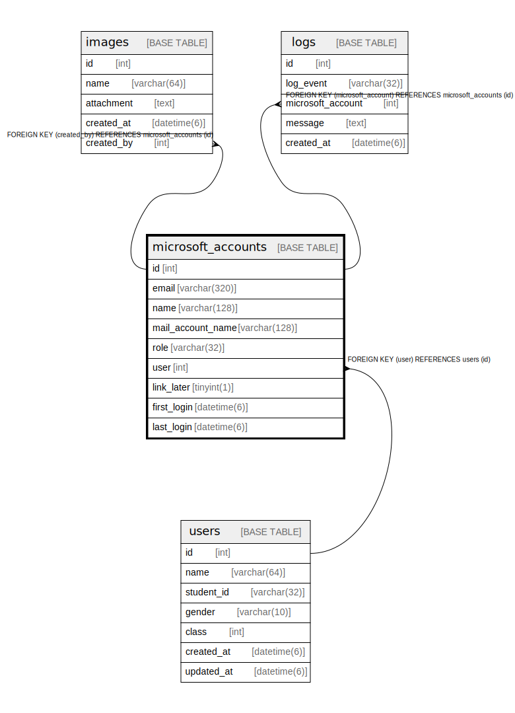

# microsoft_accounts

## Description

<details>
<summary><strong>Table Definition</strong></summary>

```sql
CREATE TABLE `microsoft_accounts` (
  `id` int NOT NULL AUTO_INCREMENT,
  `email` varchar(320) NOT NULL,
  `name` varchar(128) NOT NULL,
  `mail_account_name` varchar(128) DEFAULT NULL,
  `role` varchar(32) NOT NULL DEFAULT 'USER',
  `user` int DEFAULT NULL,
  `link_later` tinyint(1) NOT NULL DEFAULT '0',
  `first_login` datetime(6) NOT NULL,
  `last_login` datetime(6) NOT NULL,
  PRIMARY KEY (`id`),
  UNIQUE KEY `microsoft_accounts_email_unique` (`email`),
  KEY `fk_microsoft_accounts_user__id` (`user`),
  CONSTRAINT `fk_microsoft_accounts_user__id` FOREIGN KEY (`user`) REFERENCES `users` (`id`) ON DELETE SET NULL ON UPDATE RESTRICT
) ENGINE=InnoDB DEFAULT CHARSET=utf8mb4 COLLATE=utf8mb4_0900_ai_ci
```

</details>

## Columns

| Name | Type | Default | Nullable | Extra Definition | Children | Parents | Comment |
| ---- | ---- | ------- | -------- | ---------------- | -------- | ------- | ------- |
| id | int |  | false | auto_increment | [images](images.md) [logs](logs.md) |  |  |
| email | varchar(320) |  | false |  |  |  |  |
| name | varchar(128) |  | false |  |  |  |  |
| mail_account_name | varchar(128) |  | true |  |  |  |  |
| role | varchar(32) | USER | false |  |  |  |  |
| user | int |  | true |  |  | [users](users.md) |  |
| link_later | tinyint(1) | 0 | false |  |  |  |  |
| first_login | datetime(6) |  | false |  |  |  |  |
| last_login | datetime(6) |  | false |  |  |  |  |

## Constraints

| Name | Type | Definition |
| ---- | ---- | ---------- |
| fk_microsoft_accounts_user__id | FOREIGN KEY | FOREIGN KEY (user) REFERENCES users (id) |
| microsoft_accounts_email_unique | UNIQUE | UNIQUE KEY microsoft_accounts_email_unique (email) |
| PRIMARY | PRIMARY KEY | PRIMARY KEY (id) |

## Indexes

| Name | Definition |
| ---- | ---------- |
| fk_microsoft_accounts_user__id | KEY fk_microsoft_accounts_user__id (user) USING BTREE |
| PRIMARY | PRIMARY KEY (id) USING BTREE |
| microsoft_accounts_email_unique | UNIQUE KEY microsoft_accounts_email_unique (email) USING BTREE |

## Relations



---

> Generated by [tbls](https://github.com/k1LoW/tbls)
