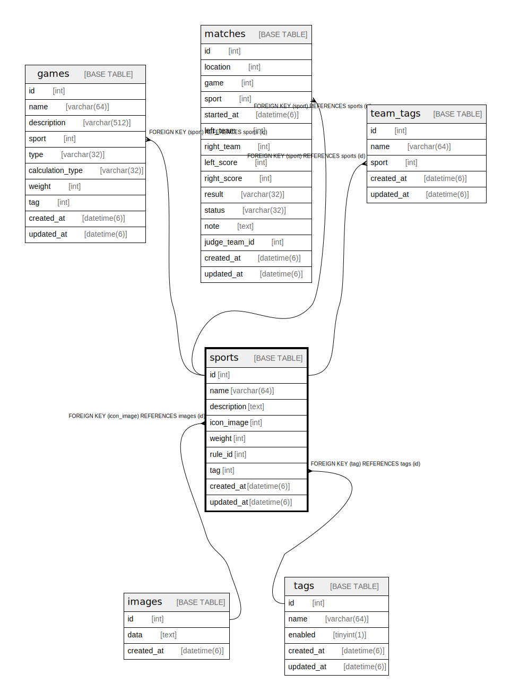

# sports

## Description

<details>
<summary><strong>Table Definition</strong></summary>

```sql
CREATE TABLE `sports` (
  `id` int NOT NULL AUTO_INCREMENT,
  `name` varchar(64) NOT NULL,
  `description` text NOT NULL,
  `icon_image` int DEFAULT NULL,
  `weight` int NOT NULL DEFAULT '0',
  `rule_id` int NOT NULL DEFAULT '0',
  `tag` int DEFAULT NULL,
  `created_at` datetime(6) NOT NULL,
  `updated_at` datetime(6) NOT NULL,
  PRIMARY KEY (`id`),
  KEY `fk_sports_icon_image__id` (`icon_image`),
  KEY `fk_sports_tag__id` (`tag`),
  CONSTRAINT `fk_sports_icon_image__id` FOREIGN KEY (`icon_image`) REFERENCES `images` (`id`) ON DELETE SET NULL ON UPDATE RESTRICT,
  CONSTRAINT `fk_sports_tag__id` FOREIGN KEY (`tag`) REFERENCES `tags` (`id`) ON DELETE SET NULL ON UPDATE RESTRICT
) ENGINE=InnoDB AUTO_INCREMENT=[Redacted by tbls] DEFAULT CHARSET=utf8mb4 COLLATE=utf8mb4_0900_ai_ci
```

</details>

## Columns

| Name | Type | Default | Nullable | Extra Definition | Children | Parents | Comment |
| ---- | ---- | ------- | -------- | ---------------- | -------- | ------- | ------- |
| id | int |  | false | auto_increment | [games](games.md) [matches](matches.md) |  |  |
| name | varchar(64) |  | false |  |  |  |  |
| description | text |  | false |  |  |  |  |
| icon_image | int |  | true |  |  | [images](images.md) |  |
| weight | int | 0 | false |  |  |  |  |
| rule_id | int | 0 | false |  |  |  |  |
| tag | int |  | true |  |  | [tags](tags.md) |  |
| created_at | datetime(6) |  | false |  |  |  |  |
| updated_at | datetime(6) |  | false |  |  |  |  |

## Constraints

| Name | Type | Definition |
| ---- | ---- | ---------- |
| fk_sports_icon_image__id | FOREIGN KEY | FOREIGN KEY (icon_image) REFERENCES images (id) |
| fk_sports_tag__id | FOREIGN KEY | FOREIGN KEY (tag) REFERENCES tags (id) |
| PRIMARY | PRIMARY KEY | PRIMARY KEY (id) |

## Indexes

| Name | Definition |
| ---- | ---------- |
| fk_sports_icon_image__id | KEY fk_sports_icon_image__id (icon_image) USING BTREE |
| fk_sports_tag__id | KEY fk_sports_tag__id (tag) USING BTREE |
| PRIMARY | PRIMARY KEY (id) USING BTREE |

## Relations



---

> Generated by [tbls](https://github.com/k1LoW/tbls)
