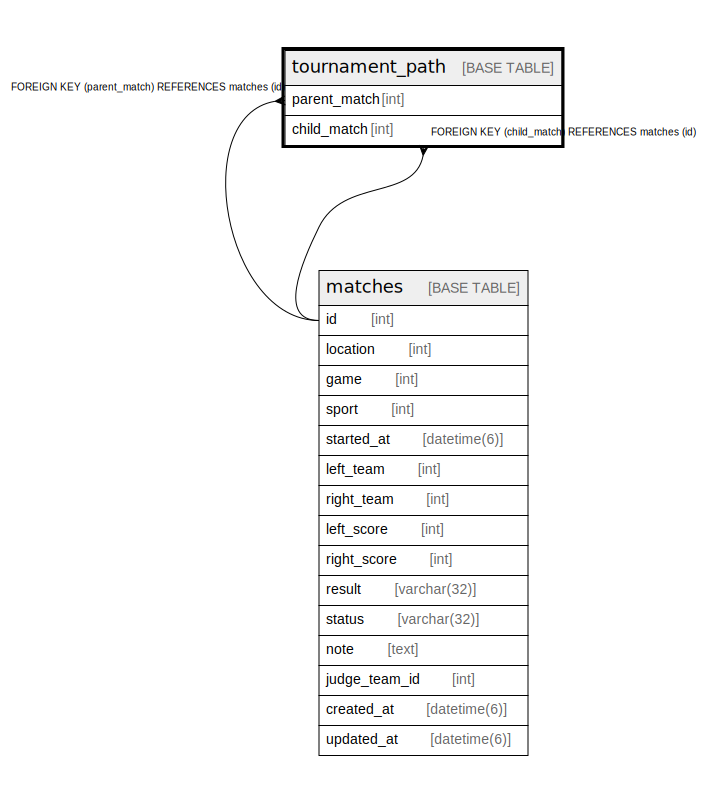

# tournament_path

## Description

<details>
<summary><strong>Table Definition</strong></summary>

```sql
CREATE TABLE `tournament_path` (
  `parent_match` int NOT NULL,
  `child_match` int NOT NULL,
  PRIMARY KEY (`parent_match`,`child_match`),
  KEY `fk_tournament_path_child_match__id` (`child_match`),
  CONSTRAINT `fk_tournament_path_child_match__id` FOREIGN KEY (`child_match`) REFERENCES `matches` (`id`) ON DELETE CASCADE ON UPDATE RESTRICT,
  CONSTRAINT `fk_tournament_path_parent_match__id` FOREIGN KEY (`parent_match`) REFERENCES `matches` (`id`) ON DELETE CASCADE ON UPDATE RESTRICT
) ENGINE=InnoDB DEFAULT CHARSET=utf8mb4 COLLATE=utf8mb4_0900_ai_ci
```

</details>

## Columns

| Name | Type | Default | Nullable | Children | Parents | Comment |
| ---- | ---- | ------- | -------- | -------- | ------- | ------- |
| parent_match | int |  | false |  | [matches](matches.md) |  |
| child_match | int |  | false |  | [matches](matches.md) |  |

## Constraints

| Name | Type | Definition |
| ---- | ---- | ---------- |
| fk_tournament_path_child_match__id | FOREIGN KEY | FOREIGN KEY (child_match) REFERENCES matches (id) |
| fk_tournament_path_parent_match__id | FOREIGN KEY | FOREIGN KEY (parent_match) REFERENCES matches (id) |
| PRIMARY | PRIMARY KEY | PRIMARY KEY (parent_match, child_match) |

## Indexes

| Name | Definition |
| ---- | ---------- |
| fk_tournament_path_child_match__id | KEY fk_tournament_path_child_match__id (child_match) USING BTREE |
| PRIMARY | PRIMARY KEY (parent_match, child_match) USING BTREE |

## Relations



---

> Generated by [tbls](https://github.com/k1LoW/tbls)
