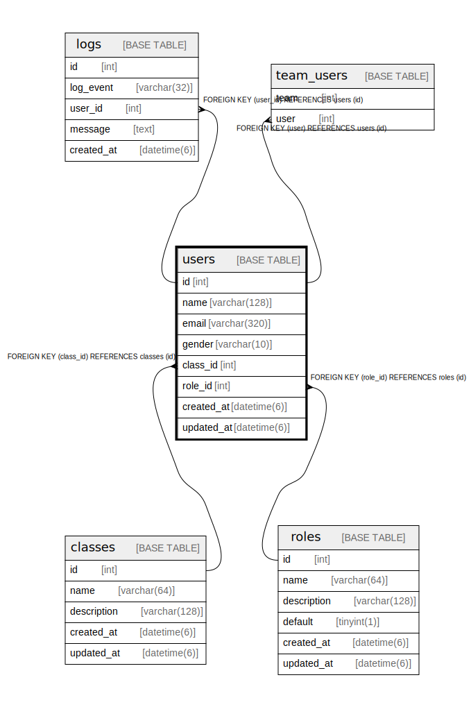

# users

## Description

<details>
<summary><strong>Table Definition</strong></summary>

```sql
CREATE TABLE `users` (
  `id` int NOT NULL AUTO_INCREMENT,
  `name` varchar(128) NOT NULL,
  `email` varchar(320) NOT NULL,
  `gender` varchar(10) NOT NULL DEFAULT 'MALE',
  `picture` varchar(2048) DEFAULT NULL,
  `class_id` int NOT NULL,
  `created_at` datetime(6) NOT NULL,
  `updated_at` datetime(6) NOT NULL,
  PRIMARY KEY (`id`),
  UNIQUE KEY `users_email_unique` (`email`),
  KEY `fk_users_class_id__id` (`class_id`),
  CONSTRAINT `fk_users_class_id__id` FOREIGN KEY (`class_id`) REFERENCES `classes` (`id`) ON DELETE CASCADE ON UPDATE RESTRICT
) ENGINE=InnoDB AUTO_INCREMENT=[Redacted by tbls] DEFAULT CHARSET=utf8mb4 COLLATE=utf8mb4_0900_ai_ci
```

</details>

## Columns

| Name | Type | Default | Nullable | Extra Definition | Children | Parents | Comment |
| ---- | ---- | ------- | -------- | ---------------- | -------- | ------- | ------- |
| id | int |  | false | auto_increment | [logs](logs.md) [team_users](team_users.md) |  |  |
| name | varchar(128) |  | false |  |  |  |  |
| email | varchar(320) |  | false |  |  |  |  |
| gender | varchar(10) | MALE | false |  |  |  |  |
| picture | varchar(2048) |  | true |  |  |  |  |
| class_id | int |  | false |  |  | [classes](classes.md) |  |
| created_at | datetime(6) |  | false |  |  |  |  |
| updated_at | datetime(6) |  | false |  |  |  |  |

## Constraints

| Name | Type | Definition |
| ---- | ---- | ---------- |
| fk_users_class_id__id | FOREIGN KEY | FOREIGN KEY (class_id) REFERENCES classes (id) |
| PRIMARY | PRIMARY KEY | PRIMARY KEY (id) |
| users_email_unique | UNIQUE | UNIQUE KEY users_email_unique (email) |

## Indexes

| Name | Definition |
| ---- | ---------- |
| fk_users_class_id__id | KEY fk_users_class_id__id (class_id) USING BTREE |
| PRIMARY | PRIMARY KEY (id) USING BTREE |
| users_email_unique | UNIQUE KEY users_email_unique (email) USING BTREE |

## Relations



---

> Generated by [tbls](https://github.com/k1LoW/tbls)
